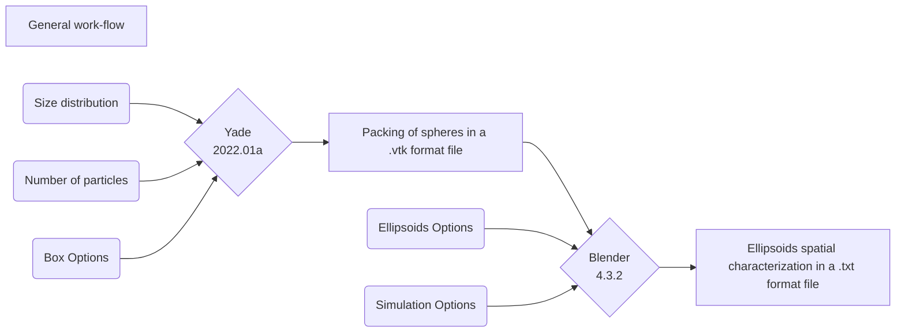

# Generation of a packing of ellipsodial particles 

## Ellipsoids packing generation

### Workflow


### Setup and Simulation
Instructions:

To create the packing of particles, you have just to modify some parameters in the setup.txt file.
The former is optimized and really fast, while the latter allows you to create particles
with different geometry (ellipsoids in this case).

The options available in the setup.txt file are here explained:
- Size Distribution: in this section, you have to insert your particle size distribution (Parameter name: Raw_x_axis_distribution. Parameters type: vector, float) and particle fraction (Parameter name: Raw_numFrac. Parameter type: vector, float). It does not matter if the sum is not equal to one because the script will arrange it later. Furthermore, if the dimension of your particles is on the order of micrometers, you should consider to scale them up (Parameter name: scale. Parameter type: scalar, float) to have a more accurate simulation and avoid numerical errors.
- Box options: here you have to specify the dimension of the simulation box. These are defined as the width and height of the box (parameters name: L and Lz, respectively)
- Number of particles: This is the number of particles that you would like to sediment (Parameter name: N_particles. Parameter type: scalar, integer). At the end of the simulation, if some particles are out of the simulation box they will be deleted.
- Ellipsoids options: in this part, you can define the geometrical characterization of the ellipsoids. First of all, you must to set on false the option that ask you if you want to sediment spheres (Parameter name: spheres. Parameter type: boolean). An ellipsoid is characterized by three semi-axis (a>b>c). The a value is taken from the particle size distribution above; the b axis is related to the a axis through an aspect ratio (Parameter name: Aspetc_ratio. Parameter type: scalar, float); the c axis has a fixed value (Parameter name: thickness. Parameter type: scalar, float).
- Simulation Options: here two parameters can help you to control the simulation. You can decide the number of simulation steps (Parameter name: step_frame. Parameter type: scalar, integer) and the friction factor between the particles (Parameter name: friction. Parameter type: scalar, float)

To start the simulation you can simply run:
```
./script
```
As a result, you will obtain a .txt format file composed of four columns. The first column is a letter followed by a closed bracket that indicates the type of data (D=dimension, R=rotation, P=position). The following three columns are float numbers of the specified data along the three directions (x, Y, and Z). You can use this file to reproduce the packaging of ellipsoids in several software to run CFD simulations. 

### Version

This script has been tested with:
- Python 3.10.4
- Yade 2022.01a
- Blender 4.3.2
- Ubuntu 20.04.06

The authors do not guarantee that the codes will work properly on systems other than those mentioned above
